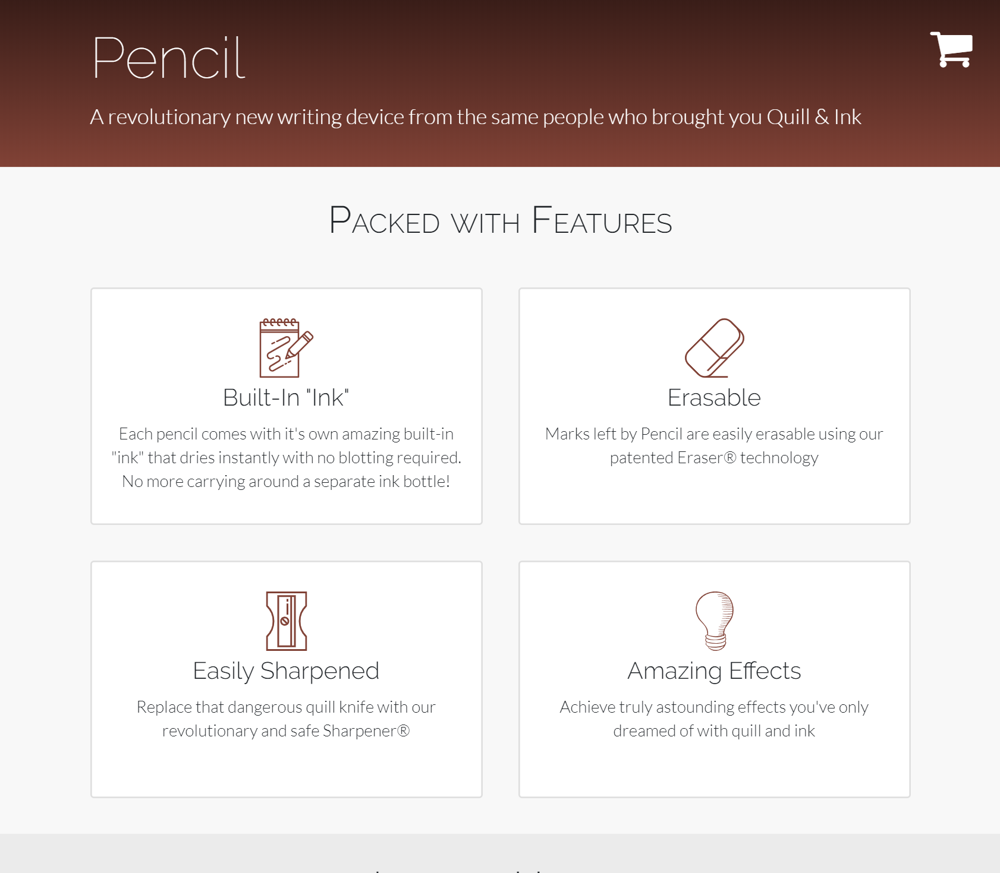
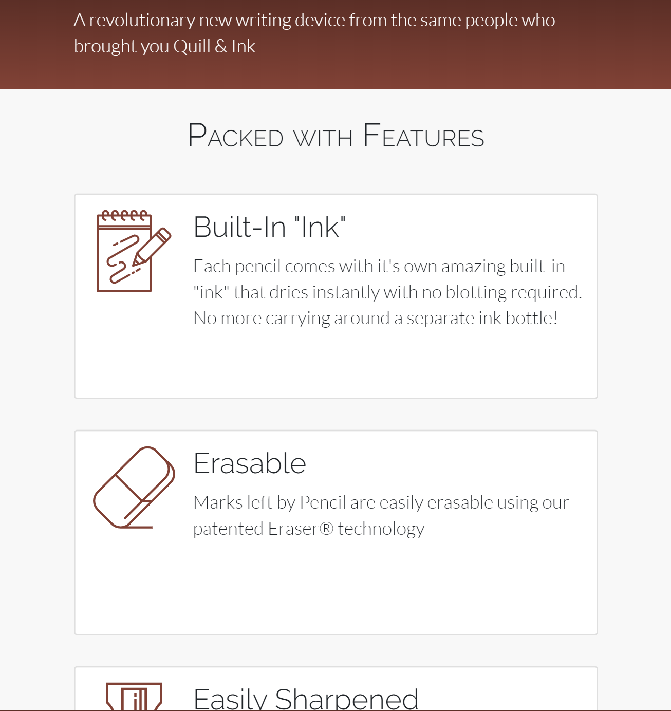
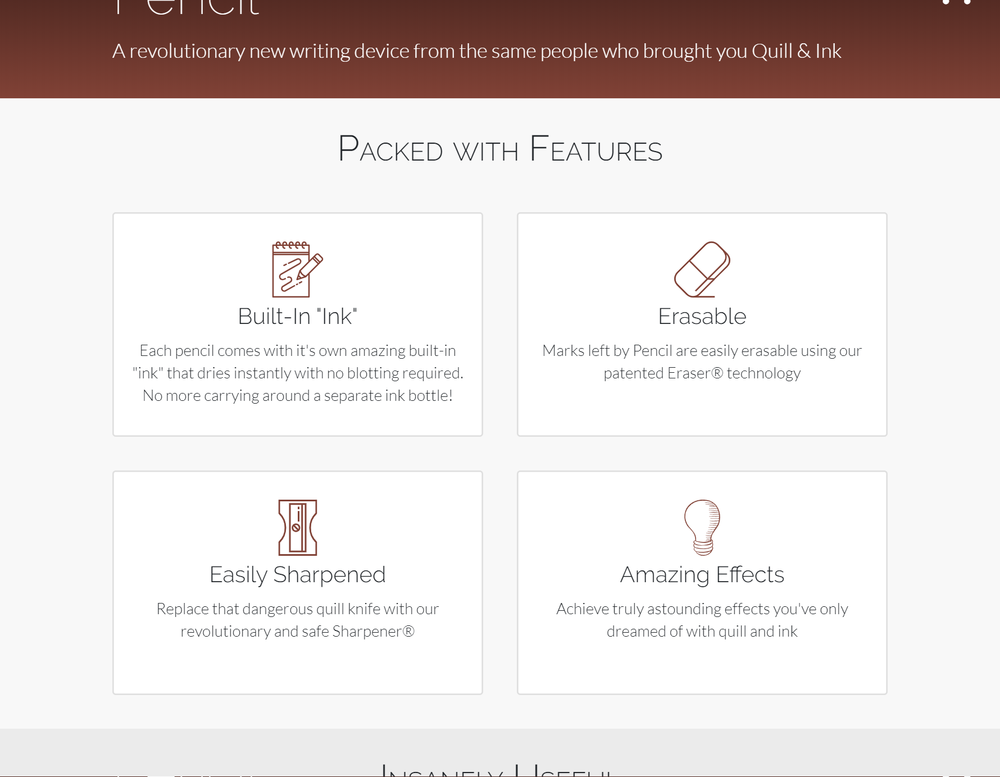
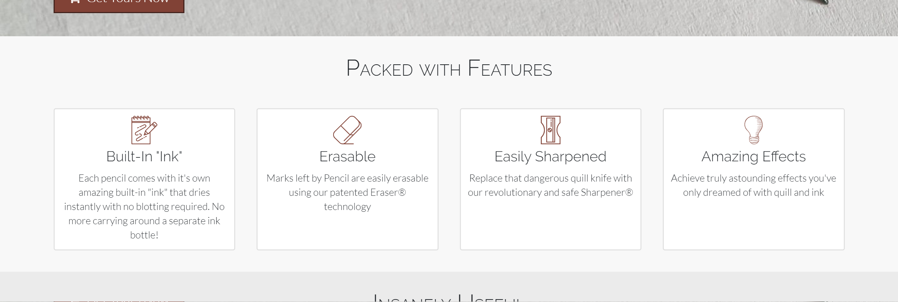
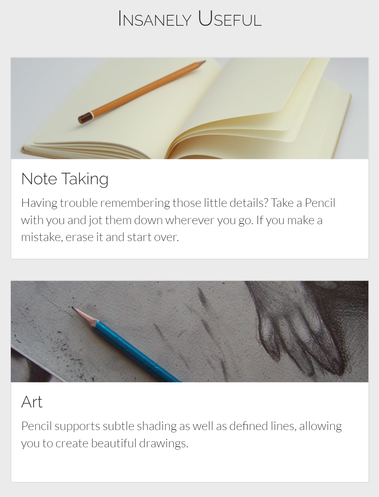
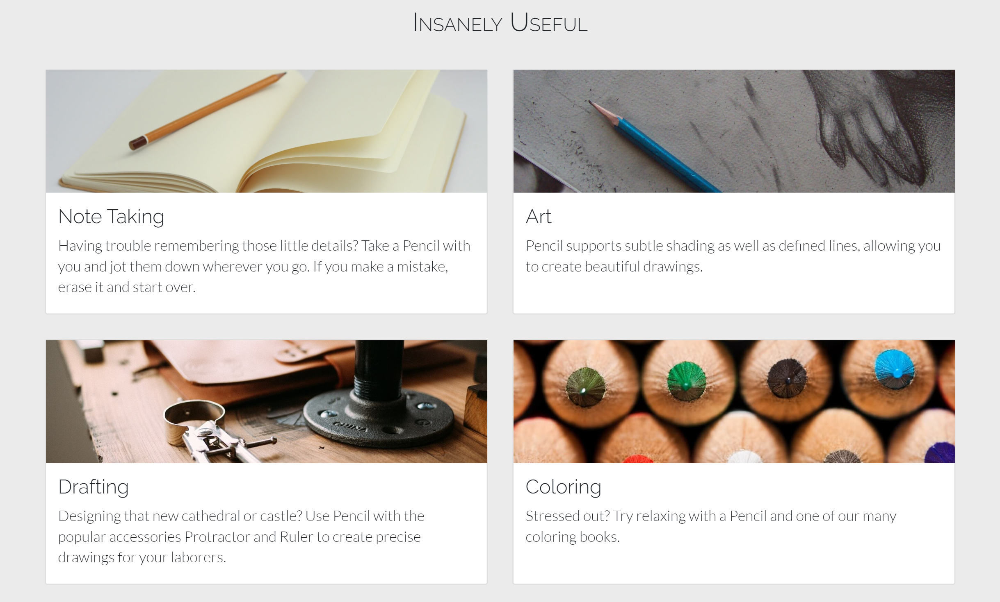

# Challenge 3 - HTML && CSS

One of the most common web development projects is a marketing site for an organization or product. Most every organization and product has one, and in this challenge you will build one of these sites for a revolutionary new product. This site will respond to the size of screen it is rendered on, and adjust its layout and styling accordingly.

## Objectives

By completing this challenge, you will practice and demonstrate the following skills:

* Writing style rules to control the formatting of your pages, including fonts, colors, links, backgrounds, borders, padding, margins, and layouts.
* Using various CSS units, including percentages, pixels, ems, hex colors, and `rgba()` colors.
* Using the Bootstrap grid system to create multi-column layouts.
* Using media queries to adjust page layout and other formatting based on the screen size.
* Implementing a page based on screenshots you would get from a graphic designer.
* Using HTML character entities to represent reserved or difficult to input characters.
* Using custom web fonts from the Google Fonts collection.

## Resources

* <a href="https://developer.mozilla.org/en-US/docs/Web/Guide/CSS/Getting_started/Selectors" target="_blank">CSS Selectors</a>
* <a href="https://developer.mozilla.org/en-US/docs/Web/CSS/Reference" target="_blank">CSS Properties</a>
* <a href="https://developer.mozilla.org/en-US/docs/Learn/CSS/Building_blocks/Values_and_units" target="_blank">CSS Units</a>
* <a href="https://developer.mozilla.org/en-US/docs/Web/CSS/Media_Queries/Using_media_queries" target="_blank">CSS Media Queries</a>
* <a href="https://getbootstrap.com/docs/4.3/layout/overview/" target="_blank">Bootstrap Documentation</a>
* <a href="https://validator.w3.org/#validate_by_upload" target="_blank">HTML Validation Service</a>
* <a href="http://jigsaw.w3.org/css-validator/#validate_by_upload" target="_blank">CSS Validation Service</a>

## Instructions

### Update your challenge repo

First, you must accept the formal invite to <a href="https://github.com/info340c-au19/" target="_blank">our Github organization</a>, so that you can update your challenges repository with the starter code for this challenge. After creating your challenges repository, you should have received an invitation. To verify, you should be able to view <a href="https://github.com/info340c-au19/challenges" target="_blank">this repo on Github</a>. If you are unable to view that repo, please contact me directly to ensure you are added.

Next, please perform the following steps in your challenges repo (on your personal machine) to update your repo and pull down the latest starter code.

1. First, verify you have no uncommitted changes: `git status`
2. Switch back to your `master` branch: `git checkout master`
3. Pull the latest code into your `master` branch: `git pull`
4. You are now ready to connect your repo to the main challenges repo. To do so, perform this command (you only need to perform this command once for each computer): `git remote add upstream https://github.com/info340c-au19/challenges.git`
5. Create a new branch for this challenge: `git checkout -b challenge3`
6. Now update your repo with the new starter code for this challenge. To do so, perform this command (you will need to perform this command once each week when a new challenge is posted): `git pull upstream master`
7. If you receive a permissions error, please check your email for an invite to the organization, and accept the invite. If you cannot find the invite, please contact the teaching team immediately.
8. If you encounter a merge conflict, you will need to resolve the merge conflict before you can start. Please contact the teaching team if you need help.
9. You can now push this new branch to Github: `git push -u origin challenge3`

You are now ready to start working on the challenge. Just like the first challenge, all work should be committed to a feature branch, and then you will open a pull request from that branch into master. You will also merge your code from your feature branch into the `gh-pages` branch to host your work on Github Pages.

## Requirements

You will build a responsive marketing site for both desktop and mobile. This is what it will look like "above the fold" on narrow mobile screens (click/tap to see full page):


But it will transform into this on wider screens (click/tap to see full page):


To see a screen shot of the entire page, use these links:

* <a href="./full_mobile.png" target="_blank">Full page at narrow screen width</a>
* <a href="./full_desktop.png" target="_blank">Full page at wide screen width</a>

Your page doesn't need to be a pixel-perfect match of these screenshots, but it should be very close. All the assets (pictures and SVG icons) are already in the `challenge3` directory in your challenges repo. I will also provide a few specifics regarding fonts, colors, and sizes. Given those, it's your job to figure out how to recreate these screenshots as a live web page.

### Create a Branch

Just as you did in the previous challenge, create a new branch for this challenge named `challenge3` in your challenges repository. Make all commits to that branch, and push that branch to GitHub. When you are done, you will merge commits from this branch in your `gh-pages` branch to publish your page to the web, and create a pull request to merge them into the `master` branch. We will use that pull request to provide in-line comments on your code.

### HTML Page

Start by looking at the `index.html` file in the `challenge3` directory within your challenges repository. The page already contains links to various resources your page needs:

* The main Bootstrap CSS file.
* The <a href="https://fonts.google.com/specimen/Lato?query=lato" target="_blank">Lato</a> and <a href="https://fonts.google.com/specimen/Raleway?query=raleway" target="_blank">Raleway</a> fonts from the Google Fonts collection
* The <a href="http://fontawesome.io/">Font Awesome</a> icon font
* Our own CSS file `css/style.css` where you will write your styling rules
* A <a href="https://developer.mozilla.org/en-US/docs/Learn/HTML/Introduction_to_HTML/The_head_metadata_in_HTML#Adding_custom_icons_to_your_site" target="_blank">page icon</a>, located in `img/pencil-icon.png`, which will show up in the browser's tab

### General Styling

Open the `css/style.css` file and add styling rules. The following general styling should applied for all screen widths:

* Body text should be rendered in `Lato`, with `Helvetica Neue`, `Helvetica`, `Arial`, and finally `sans-serif` as fallback fonts.
* Body text should be rendered at `300` weight.
* Body text should be rendered at `18` pixels in height.
* All <a href="https://developer.mozilla.org/en-US/docs/Web/HTML/Element/Heading_Elements" target="_blank">headings</a> should be in `Raleway` with the same set of fallback fonts as the body text.
* All headings should have no margin on top, but the margin on the bottom should be half the <a href="https://developer.mozilla.org/en-US/docs/Learn/CSS/Building_blocks/Values_and_units#Relative_length_units" target="_blank">height of the root element's font size</a>.
* Level 1 headings should use a very thin font weight of `100`.
* Line height on paragraphs should be `1.43`.
* Paragraphs should have no margin on top, but the margin on the bottom should be the same height as the root element's font size.

### Page Header

At the top of the page is the header element. On larger screens we will show a cool background image, but on smaller mobile screens we will use a gradient fill so that it renders quickly and doesn't consume data bandwidth.

Page header on narrow mobile device screens.


Page header on tablet.


Page header on screens 992 pixels and wider.


Add the elements necessary for this page header. A few tips:

* All of the text should be constrained in width so that it doesn't get too wide on large desktop monitors. Use the `container` style class from Bootstrap to do this.
* The "Pencil" text should be a level 1 heading, and the other text should be a normal paragraph.
* The <a href="http://fontawesome.io/icon/shopping-cart/" target="_blank">shopping cart</a> icon comes from the font awesome icon font, which is already added to your page. Surround it with a hyperlink so that when it's clicked, the browser navigates to`https://amzn.com/B0188A3N16`. Since it doesn't have any text on narrow screens, you should include an <a href="https://developer.mozilla.org/en-US/docs/Web/Accessibility/ARIA/ARIA_Techniques/Using_the_aria-label_attribute" target="_blank">aria-label</a> attribute that describes what the link points to.
* The "Get Yours Now" button should actually be a hyperlink element, also pointing to `https://amzn.com/B0188A3N16`. Use CSS formatting properties to make it look like a button.

Then add the style rules so that your content matches the screen shots above. A few specifics you will need:

* On small screens, the header background should have only a <a href="https://developer.mozilla.org/en-US/docs/Web/CSS/linear-gradient" target="_blank">linear gradient</a> fill. The gradient should start with the color `#391D18` at the top, and fade into `#814236` at the bottom.
* On screens `992` pixels and wider, the background should switch to using the image `img/header.jpg`. It should `cover` the entire background of the header element, and be <a href="https://developer.mozilla.org/en-US/docs/Web/CSS/background-position" target="_blank">positioned</a> so that it remains centered horizontally, but at the bottom of the image vertically.
* Although the "Get Yours Now" button is a hyperlink element, your styling rules should make it look like a button, as shown in the screenshot. The background color should be `#814236` and the border color should be `#391D18`.

### Features Section

The next section displays four feature "cards" for this new device in a responsive grid layout. Each card includes an icon, a title, and some descriptive text. The layout adjusts as follows:

Features section on narrow mobile device screens.



Features section on screens 768 pixels and wider.



Features section on screens 992 pixels and wider.




Add the elements for the features section of the page. A few tips:

* All of the content in this section should be constrained in width so that it doesn't get too wide on large desktop monitors, but the background color of the entire section should still extend all the way to the edge of the browser window. Make use of the `container` style class already defined for you in `css/style.css`.
* The "Packed with Features" text should be a level 2 heading, while the feature titles should be level 3 headings.
* The icons are in the `svg` sub-directory. Copy and paste the contents of those SVG files into your HTML page so that you can style them (you can't adjust their colors if you use an ``element that points to the SVG file). Later in the course I will show you how to use a tool like gulp to do this insertion of content during an automated build step.
* Use an HTML symbol entity for the <a href="http://www.rapidtables.com/web/html/html-codes/html-code-tm.htm" target="_blank">registered trademark symbol</a>, and make it superscript text.

Add style rules so that your content matches the screen shots above. A few specifics you will need:

* The section background color should be `#F8F8F8`.
* The "Packed with Features" text should be in <a href="http://www.w3schools.com/cssref/pr_font_font-variant.asp" target="_blank">small-caps</a>.
* The color of the icons should be `#814236`. Note that the CSS property that controls the color of SVG elements is not the same one that controls the color of text.
* The color of the border around each feature card should be `#DFDFDF` and the corners of the border should be <a href="https://css-tricks.com/almanac/properties/b/border-radius/">rounded</a> by `3px`.
* The background color of each card should be white.
* On narrow mobile screens, the feature cards should be stacked on top of each other, with the feature icon on the left, as shown above.
* On screens `768` pixels and wider, the cards should be in a 2x2 layout, and the icons should appear on top of the feature title.
* On screens `992` pixels and wider, the cards should be in a 1x4 layout.

### Uses Section

The next section describes a few uses for this revolutionary new device. Like the section above, these cards are in a responsive grid layout, but they also have images at the top of each card.

Uses section on narrow mobile device screens.




Uses section on screens 768 pixels and wider.


Uses section on screens 992 pixels and wider.




Add the elements for this section of the page. A few tips:

* All of the content should be constrained in width so that it doesn't get ridiculously wide on large desktop monitors, but the background color should extend to the edges of the browser window.
* You should use the same style classes you used for the feature cards on these usage cards. They should have the same border color, rounded corners, and background color.

Add style rules so that your content matches the screen shots above. A few specifics you will need:

* The section background color should be `#EBEBEB`.
* The various images are in the `img` sub-directory. Each image should cover the top part of the card and be `150` pixels tall.
* On narrow mobile screens, the usage cards should be stacked on top of each other.
* On screens `992` pixels and wider, the layout should become a 2x2 grid, as shown above.

### Testimonials Section

Following the grand tradition of marketing sites, the next section contains testimonials from happy users. These are also displayed in a responsive layout. Next to each testimonial is a rounded profile picture.

Testimonials section on narrow mobile device screens.


Testimonials section on screens 768 pixels and wider.


Add the elements for this section of the page. A few specific requirements and options:

* All of the content should be constrained in width so that it doesn't get ridiculously wide on large desktop monitors, but the background color should extend to the edge of the browser window.
* Both images should come from `https://s.gravatar.com/avatar/15eb900ce1878bc2a26399ab7f4309e7?s=80`. You can also create <a href="https://en.gravatar.com/" target="_blank">Gravatar</a> account, upload your own profile picture, and use it instead. See <a href="https://en.gravatar.com/site/implement/images/" target="_blank">their API</a> for details on the URL format. To get the MD5 hash for your email address, use this <a href="http://www.miraclesalad.com/webtools/md5.php" target="_blank">MD5 generator site</a>.

Add style rules so that your content matches the screen shots above. A few specifics you will need:

* The section background color should be `#F8F8F8`.
* The person's name should be in normal black text, but their title should be only `80` percent as tall and in the color `#999999`.
* The profile picture should appear to the left of the name and text, as shown above.
* The profile picture should be <a href="https://css-tricks.com/almanac/properties/b/border-radius/" target="_blank">rounded into a circle</a>, even though the original image is a rectangle.
* On narrow mobile screens, the testimonials should stack on top of each other.
* On screens `768` pixels and wider, they should appear side-by-side.

### Footer

At the bottom of the page is the footer, which traditionally contains copyright and attribution information, along with a set of contact links.

Page footer on narrow mobile device screens.


Page Footer section on screens 768 pixels and wider.


Add the elements for this section of the page. A few notes:

* The copyright symbol should be added using an HTML symbol entity.
* The contact link icons are from the Font Awesome icon font. From left-to-right, they are:
 * <a href="http://fontawesome.io/icon/envelope/" target="_blank">envelope</a>: should be surrounded by a hyperlink that when clicked starts a new email message addressed to `info@pencil.com`.
 * <a href="http://fontawesome.io/icon/twitter/" target="_blank">twitter</a>: should be surrounded by a hyperlink that when clicked navigates to `https://twitter.com/pencilorg`.
 * <a href="http://fontawesome.io/icon/facebook/" target="_blank">facebook</a>: should be surrounded by a hyperlink that when clicked navigates to `https://www.facebook.com/search/top/?q=pencil`.Since these icons have no text that a screen reader can read, add `aria-label` attributes to them. The text in that attribute will be spoken by the screen reader when the user tabs to the surrounding hyperlink.
* Use this for the attribution text:

```html
<p>
    Icons made by
    <a href="http://www.freepik.com">Freepik</a>
    from
    <a href="http://www.flaticon.com">www.flaticon.com</a>
    is licensed by
    <a href="http://creativecommons.org/licenses/by/3.0/">CC 3.0 BY</a>
</p>
```

Add style rules so that your content matches the screen shots above. A few specifics you will need:

* The background color should be `#391D18`.
* The text color should be `#EEEEEE`.
* The hyperlink text color should be `#AAAAAA` and should <a href="http://www.w3schools.com/css/css_link.asp" target="_blank">not have any underlining</a>, even when you hover over the hyperlinks with a mouse.

## Submitting Your Assignment

To submit your assignment, please do the following:

* Validate your HTML and CSS using the W3C validators. If you receive validation errors for SVGs when validating your CSS, click "More Options", and under "Profile", select "CSS Level 3 + SVG".
* Merge your commits from the `challenge3` branch into your `gh-pages` branch, and push that branch to GitHub. This will publish your site to the web.
* Over on GitHub, create a pull request to merge commits made to the `challenge3` branch into the `master` branch. We will use this pull request to add in-line comments on your code. **Do not approve the pull request** by completing the merge. We will do that once we have finished grading. 
* Include a link to the page on Github Pages in the description of the pull request.
* Submit a link to that pull request via this assignment.
